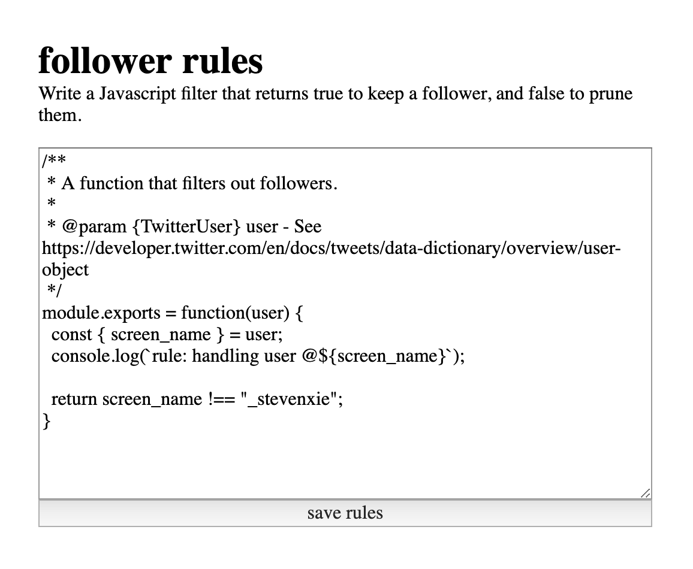

# tailguard

_A rule engine for curating your Twitter followers._

> `tailguard` is still under development! Check back for updates :)

<p align="center">
  
</p>

## Usage

> To run this self-hosted service, you may need to
> [apply to become a Twitter Developer](https://developer.twitter.com/en/apply/user.html),
> and create an application under your account.
>
> This process takes about 5 minutes, and does not require manual approval
> by Twitter.

1. Pull the repo:


    ```bash
    git clone git@github.com:stevenxie/tailguard && \
    cd tailguard
    ```

2. Set environment variables:

   ```bash
   cat <<EOF > ./server/.env.local
   TWITTER_TOKEN=...
   TWITTER_SECRET=...
   TWITTER_CONSUMER_KEY=...
   TWITTER_CONSUMER_SECRET=...
   EOF
   ```

   > `TWITTER_TOKEN` and `TWITTER_SECRET` refer to personal access tokens for the
   > app to perform actions on behalf of your account.
   >
   > `TWITTER_CONSUMER_KEY` and `TWITTER_CONSUMER_SECRET` are application keys
   > that Twitter requires for third-party apps to make requests to the API.
   >
   > All keys and tokens can be found at:
   > [Twitter Developer Apps](https://developer.twitter.com/en/apps) >
   > [the app name you registered] > Keys and tokens.

3. Install dependencies, and start:

   ```bash
   npm install && \
   npm start
   ```

## TODO

- [ ] Make the UI actually pleasant.
- [ ] Show outcomes of recent invocations / errors on the UI.
- [ ] Implement "sign in with Twitter".
- [ ] Use "Authorization" header for authentication.
- [ ] Make rule lambdas take in third parameter which an object filled with
      utility functions:

  ```javascript
  module.exports = function (follower, twitter, { isFollowed /*, ... */ }) {
    return isFollowed(follower);
  };
  ```
